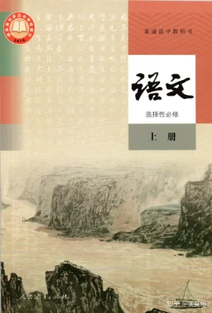
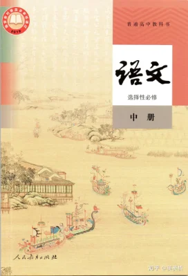
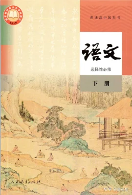

# 课程思政教学素材

## 高中语文必修上册

[教学素材](./book1.html)

\
\
\
\
&nbsp;

## 高中语文必修下册

[教学素材](./book2.html)

\
\
\
\
&nbsp;

## 高中语文选择性必修上册

[教学素材](./book3.html)

\
\
\
\
&nbsp;

## 高中语文选择性必修中册

[教学素材](./book4.html)

\
\
\
\
&nbsp;

## 高中语文选择性必修下册

[教学素材](./book5.html)

\
\
\
\
&nbsp;

